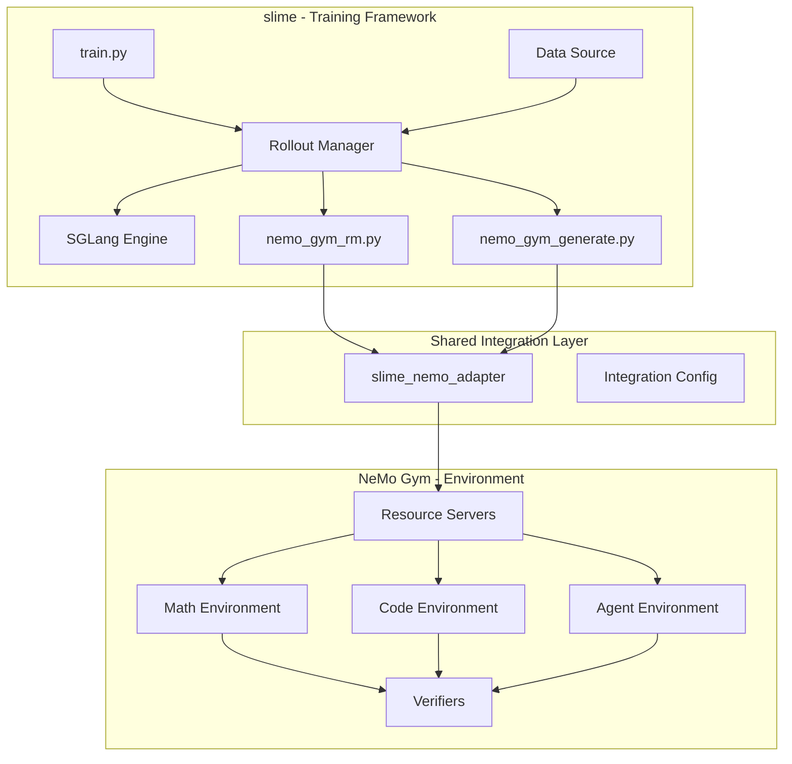

# slime + NeMo Gym 통합 계획

> NeMo Gym을 slime의 환경/검증기로 통합하여, slime이 훈련을 담당하고 NeMo Gym이 다양한 도메인(수학, 코딩, 에이전트)의 환경과 리워드 검증을 제공하도록 합니다.

---

## TODO List

### Phase 1: 기본 통합 레이어
- [ ] **통합 레이어 디렉토리 구조 생성** (`slime/integrations/nemo_gym/`)
- [ ] **NeMo Gym HTTP 클라이언트 구현** (`client.py`)
- [ ] **Sample ↔ NeMo Gym 데이터 어댑터 구현** (`adapter.py`)
- [ ] **커스텀 RM 함수 구현** (`rm.py`)

### Phase 2: 멀티턴 에이전트 지원
- [ ] **멀티턴 에이전트용 커스텀 Generate 함수 구현** (`generate.py`)

### Phase 3: 설정 및 스크립트
- [ ] **통합 설정 및 인자 추가** (`config.py`, `arguments.py`)
- [ ] **통합 실행 스크립트 작성** (`run_with_nemo_gym.sh`)

### Phase 4: 예제 및 테스트
- [ ] **도메인별 훈련 예제 작성** (math, code, agent)
- [ ] **통합 테스트 작성**

---

## 아키텍처 개요



---

## 핵심 통합 지점

| slime 인터페이스 | 용도 | NeMo Gym 연결 |
|-----------------|------|--------------|
| `--custom-rm-path` | 커스텀 리워드 함수 | NeMo Gym `/verify` 엔드포인트 호출 |
| `--custom-generate-function-path` | 커스텀 생성 함수 | 멀티턴 에이전트 환경 지원 |
| `--rm-url` | 원격 RM 서버 | NeMo Gym Resource Server URL |

---

## 파일 구조

```
slime/
├── slime/
│   ├── integrations/           # 새로 생성
│   │   ├── __init__.py
│   │   ├── nemo_gym/
│   │   │   ├── __init__.py
│   │   │   ├── client.py       # NeMo Gym HTTP 클라이언트
│   │   │   ├── rm.py           # 커스텀 RM 함수
│   │   │   ├── generate.py     # 멀티턴 생성 함수
│   │   │   └── adapter.py      # Sample ↔ NeMo Gym 변환
│   │   └── config.py           # 통합 설정
│   └── ...
├── scripts/
│   └── run_with_nemo_gym.sh    # 통합 실행 스크립트
└── examples/
    └── nemo_gym_integration/   # 통합 예제
        ├── math_training.sh
        ├── code_training.sh
        └── agent_training.sh
```

---

## 구현 단계

### Phase 1: 기본 통합 레이어

#### 1.1 NeMo Gym 클라이언트 (`slime/slime/integrations/nemo_gym/client.py`)

NeMo Gym Resource Server와 HTTP 통신하는 클라이언트:

```python
class NemoGymClient:
    async def verify(self, server_url: str, request: VerifyRequest) -> VerifyResponse
    async def seed_session(self, server_url: str) -> SeedSessionResponse
```

#### 1.2 데이터 어댑터 (`slime/slime/integrations/nemo_gym/adapter.py`)

slime `Sample`과 NeMo Gym Request/Response 간 변환:

```python
def sample_to_verify_request(sample: Sample, env_config: dict) -> dict
def verify_response_to_reward(response: dict) -> float
```

#### 1.3 커스텀 RM 함수 (`slime/slime/integrations/nemo_gym/rm.py`)

slime의 `--custom-rm-path`로 지정할 함수:

```python
async def nemo_gym_rm(args, sample: Sample) -> float:
    # NeMo Gym verify 엔드포인트 호출
    # reward 반환
```

---

### Phase 2: 멀티턴 에이전트 지원

#### 2.1 커스텀 Generate 함수 (`slime/slime/integrations/nemo_gym/generate.py`)

에이전트 환경에서 멀티턴 상호작용 지원:

```python
async def nemo_gym_generate(args, sample: Sample, sampling_params: dict) -> Sample:
    # 1. SGLang으로 응답 생성
    # 2. NeMo Gym 도구 호출 처리
    # 3. 멀티턴 반복
    # 4. 최종 검증 및 리워드
```

---

### Phase 3: 설정 및 스크립트

#### 3.1 통합 설정 (`slime/slime/integrations/config.py`)

```python
@dataclass
class NemoGymIntegrationConfig:
    resource_server_url: str
    environment_name: str
    verify_endpoint: str = "/verify"
    timeout: float = 30.0
```

#### 3.2 실행 스크립트 (`slime/scripts/run_with_nemo_gym.sh`)

NeMo Gym 서버 시작 + slime 훈련 실행을 하나로:

```bash
# 1. NeMo Gym 서버 시작
# 2. slime 훈련 실행 (--custom-rm-path 지정)
# 3. 정리
```

---

### Phase 4: 예제 및 테스트

#### 4.1 수학 훈련 예제
- NeMo Gym `math_with_judge` 환경 사용
- slime으로 수학 추론 모델 훈련

#### 4.2 코딩 훈련 예제
- NeMo Gym `code_gen` 환경 사용
- 코드 생성 모델 훈련

#### 4.3 에이전트 훈련 예제
- NeMo Gym `workplace_assistant` 환경 사용
- 멀티턴 도구 사용 에이전트 훈련

---

## 사용 예시

```bash
# 1. NeMo Gym 서버 시작 (별도 터미널)
cd Gym
ng_run "+config_paths=[resources_servers/math_with_judge/configs/math_with_judge.yaml]"

# 2. slime 훈련 실행
cd slime
python train.py \
    --custom-rm-path slime.integrations.nemo_gym.rm:nemo_gym_rm \
    --nemo-gym-server-url http://localhost:8000 \
    --nemo-gym-environment math_with_judge \
    ... (기타 훈련 인자)
```

---

## 의존성

slime의 `requirements.txt`에 추가:

```
aiohttp>=3.8.0
pydantic>=2.0.0
```

---

## 참고 자료

- [slime GitHub](https://github.com/THUDM/slime)
- [NeMo Gym GitHub](https://github.com/NVIDIA-NeMo/Gym)
- [slime Documentation](https://thudm.github.io/slime/)
- [NeMo Gym Documentation](https://docs.nvidia.com/nemo/gym/latest/index.html)
