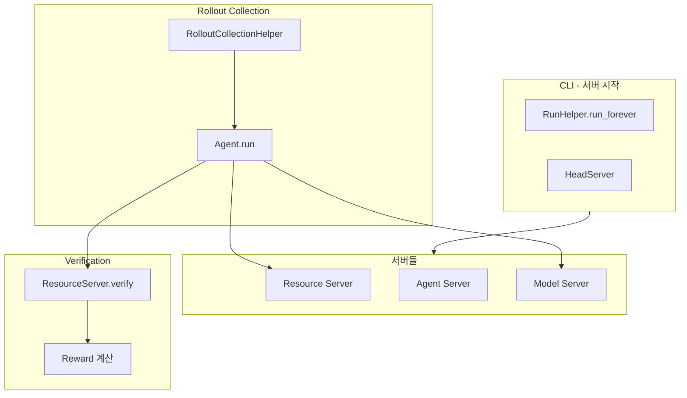

# NeMo Gym 코드 흐름 가이드

> NeMo Gym의 함수 흐름과 각 함수의 역할 설명 (slime 통합 관점)

---

## 전체 아키텍처 개요



---

## 1. 서버 시작 및 초기화

### `cli.py::run()`
**역할**: NeMo Gym 서버들을 시작하는 메인 진입점

**주요 작업**:
- Global config 로드
- RunHelper 생성 및 실행

**호출 흐름**:
```
run()
  → RunHelper.__init__()
  → RunHelper.run_forever()
```

---

### `cli.py::RunHelper.run_forever()`
**역할**: 모든 서버 인스턴스를 시작하고 관리

**주요 작업**:
1. Head Server 시작 (서버 등록 및 설정 제공)
2. 각 서버 인스턴스 시작 (Resource Server, Agent, Model)
3. 서버 상태 모니터링
4. 서버 종료 처리

**핵심 로직**:
```python
# Head Server 시작
head_server, thread, server = HeadServer.run_webserver()

# 각 서버 인스턴스 시작
for instance_config in server_instances:
    process = _run_command(start_cmd, working_dir)
    # 서버 프로세스 관리
```

**서버 타입**:
- `ResourceServer`: 환경 및 검증 제공
- `ResponsesAPIAgent`: 에이전트 오케스트레이션
- `ResponsesAPIModel`: LLM 추론 서버

---

### `server_utils.py::SimpleServer.run_webserver()`
**역할**: FastAPI 웹서버 시작

**주요 작업**:
1. Global config에서 서버 설정 로드
2. ServerClient 초기화
3. FastAPI 앱 생성 및 엔드포인트 등록
4. Uvicorn으로 서버 실행

**호출 흐름**:
```
run_webserver()
  → load_config_from_global_config()
  → ServerClient 초기화
  → setup_webserver()  # FastAPI 앱 생성
  → uvicorn.run()
```

---

### `base_resources_server.py::SimpleResourcesServer.setup_webserver()`
**역할**: Resource Server의 FastAPI 엔드포인트 등록

**등록되는 엔드포인트**:
- `POST /seed_session`: 세션 초기화
- `POST /verify`: 응답 검증 및 리워드 계산

**추가 엔드포인트**: 각 Resource Server 구현체에서 커스텀 엔드포인트 추가 가능

---

### `base_responses_api_agent.py::SimpleResponsesAPIAgent.setup_webserver()`
**역할**: Agent Server의 FastAPI 엔드포인트 등록

**등록되는 엔드포인트**:
- `POST /v1/responses`: 멀티턴 상호작용 (도구 호출 포함)
- `POST /run`: 전체 rollout 실행 (seed → responses → verify)

---

## 2. Rollout Collection 흐름

### `rollout_collection.py::collect_rollouts()`
**역할**: 배치 rollout 수집의 진입점

**주요 작업**:
- RolloutCollectionConfig 로드
- RolloutCollectionHelper 실행

**호출 흐름**:
```
collect_rollouts()
  → RolloutCollectionConfig.model_validate()
  → RolloutCollectionHelper.run_from_config()
```

---

### `rollout_collection.py::RolloutCollectionHelper.run_from_config()`
**역할**: 입력 데이터에서 rollout 수집

**주요 작업**:
1. 입력 JSONL 파일 읽기
2. 각 행에 대해 Agent의 `/run` 엔드포인트 호출
3. 결과를 출력 JSONL 파일에 저장
4. 평균 메트릭 계산

**핵심 로직**:
```python
async def _post_coroutine(row: dict):
    response = await server_client.post(
        server_name=config.agent_name,
        url_path="/run",
        json=row
    )
    result = await response.json()
    f.write(json.dumps(result) + "\n")
    metrics.update({k: v for k, v in result.items() if isinstance(v, (int, float))})

await tqdm.gather(*map(_post_coroutine, rows))
```

**입력 형식**:
```json
{
  "responses_create_params": {
    "input": [{"role": "user", "content": "..."}],
    "temperature": 0.7,
    "max_output_tokens": 1000
  }
}
```

**출력 형식**:
```json
{
  "response": {...},
  "reward": 1.0,
  ...
}
```

---

## 3. Agent 실행 흐름

### `simple_agent/app.py::SimpleAgent.run()`
**역할**: 하나의 rollout 실행 (seed → generate → verify)

**주요 작업**:
1. Resource Server에 세션 초기화 요청 (`/seed_session`)
2. Agent의 응답 생성 (`/v1/responses`)
3. Resource Server에 검증 요청 (`/verify`)

**호출 흐름**:
```
run(body: SimpleAgentRunRequest)
  → POST /seed_session [Resource Server]
  → POST /v1/responses [Agent 자신]
    → responses() 메서드 호출
  → POST /verify [Resource Server]
```

**반환값**: `SimpleAgentVerifyResponse` (response + reward 포함)

---

### `simple_agent/app.py::SimpleAgent.responses()`
**역할**: 멀티턴 상호작용 및 도구 호출 처리

**주요 작업**:
1. Model Server에 텍스트 생성 요청
2. Function call 감지
3. Resource Server에 도구 호출
4. 도구 결과를 컨텍스트에 추가하고 반복

**핵심 루프**:
```python
while True:
    # 1. Model Server에 생성 요청
    model_response = await self.server_client.post(
        server_name=self.config.model_server.name,
        url_path="/v1/responses",
        json=new_body
    )
    
    # 2. Function call 추출
    all_fn_calls = [o for o in output if o.type == "function_call"]
    
    # 3. 각 Function call 실행
    for fn_call in all_fn_calls:
        api_response = await self.server_client.post(
            server_name=self.config.resources_server.name,
            url_path=f"/{fn_call.name}",
            json=json.loads(fn_call.arguments)
        )
        tool_response = NeMoGymFunctionCallOutput(...)
        new_outputs.append(tool_response)
    
    # 4. 종료 조건 확인
    if not all_fn_calls and all_output_messages:
        break
```

**멀티턴 구조**:
- 각 턴에서 Model → Function Call → Resource Server → 결과를 컨텍스트에 추가
- 최종 응답은 모든 턴의 output을 합친 것

---

## 4. Resource Server 검증 흐름

### `base_resources_server.py::SimpleResourcesServer.verify()`
**역할**: 응답 검증 및 리워드 계산 (추상 메서드)

**입력**: `BaseVerifyRequest`
- `responses_create_params`: 원본 요청 파라미터
- `response`: 생성된 응답 (`NeMoGymResponse`)

**출력**: `BaseVerifyResponse`
- `reward`: 리워드 값 (float)
- 원본 요청 및 응답 포함

**구현**: 각 Resource Server가 도메인별로 구현

---

### `resources_servers/math_with_judge/app.py::LibraryJudgeMathResourcesServer.verify()`
**역할**: 수학 문제 검증 (구체적 구현 예시)

**주요 작업**:
1. 응답에서 텍스트 추출
2. Library 검증 (math_verify 라이브러리)
3. Judge 검증 (LLM-as-a-judge, 선택적)

**호출 흐름**:
```
verify(body: LibraryJudgeMathVerifyRequest)
  → 응답 텍스트 추출
  → _verify_answer()
    → _verify_answer_with_library()  # 수학 라이브러리 검증
    → _verify_answer_with_judge()    # LLM Judge (선택적)
  → LibraryJudgeMathVerifyResponse 반환
```

---

### `resources_servers/math_with_judge/app.py::_verify_answer_with_library()`
**역할**: 수학 라이브러리로 정답 검증

**주요 작업**:
- `math_verify` 라이브러리 사용
- 예상 답변과 생성 답변 비교
- 수학적 등가성 검증

**반환값**: `(reward: float, extracted_answer: str)`

---

### `resources_servers/math_with_judge/app.py::_verify_answer_with_judge()`
**역할**: LLM Judge로 정답 검증 (Library 검증 실패 시)

**주요 작업**:
1. Judge 모델에 프롬프트 생성
2. 두 답변의 등가성 평가 요청
3. Judge 응답 파싱 (`[[A=B]]` 또는 `[[A!=B]]`)

**Judge 프롬프트 구조**:
```
System: "Please act as an impartial judge..."
User: "<|Problem|>\n{question}\n\n<|Assistant A's Answer|>\n{first}\n<|Assistant B's Answer|>\n{second}"
```

**반환값**: `(reward: float, judge_evaluations: list)`

---

## 5. 서버 간 통신

### `server_utils.py::ServerClient`
**역할**: 서버 간 HTTP 통신 클라이언트

**주요 메서드**:
- `post(server_name, url_path, json, cookies)`: POST 요청
- `get(server_name, url_path)`: GET 요청

**서버 발견**:
- Global config에서 서버 이름으로 URL 조회
- Head Server를 통해 서버 인스턴스 정보 가져오기

**세션 관리**:
- Cookie를 통한 세션 상태 유지
- Resource Server의 세션 상태 관리 지원

---

## 6. slime 통합 시 중요한 부분

### 통합 지점 1: Rollout Collection → slime RM
**현재 NeMo Gym**:
```python
# rollout_collection.py
response = await server_client.post(agent_name, "/run", json=row)
result = await response.json()
# result["reward"] 사용
```

**slime 통합 시**:
```python
# slime의 async_rm()에서
async def nemo_gym_rm(args, sample: Sample) -> float:
    # NeMo Gym Resource Server의 /verify 엔드포인트 직접 호출
    verify_request = {
        "responses_create_params": {...},
        "response": NeMoGymResponse.from_sample(sample)
    }
    response = await client.post(resource_server_url, "/verify", json=verify_request)
    result = await response.json()
    return result["reward"]
```

---

### 통합 지점 2: 멀티턴 에이전트 지원
**현재 NeMo Gym**:
- Agent가 자동으로 멀티턴 처리
- Function call → Resource Server → 결과 반환

**slime 통합 시**:
- slime의 `custom_generate_function_path` 사용
- NeMo Gym Agent의 `/v1/responses` 엔드포인트 호출
- 멀티턴 상호작용을 slime의 Sample에 반영

---

### 통합 지점 3: 세션 관리
**NeMo Gym의 세션 관리**:
- Cookie 기반 세션 상태
- `/seed_session`으로 초기화
- Resource Server가 세션 상태 유지

**slime 통합 시 고려사항**:
- 각 Sample마다 새로운 세션 시작 (`/seed_session`)
- 멀티턴 Sample의 경우 동일 세션 유지
- 세션 종료 처리

---

## 핵심 함수 체인 요약

### Rollout Collection 체인
```
collect_rollouts()
  → RolloutCollectionHelper.run_from_config()
    → _post_coroutine(row)
      → ServerClient.post(agent_name, "/run")
        → SimpleAgent.run()
          → POST /seed_session
          → SimpleAgent.responses()
            → POST /v1/responses [Model Server]
            → POST /{function_name} [Resource Server]
          → POST /verify
            → ResourceServer.verify()
              → _verify_answer()
                → _verify_answer_with_library()
                → _verify_answer_with_judge()
```

### 서버 시작 체인
```
run()
  → RunHelper.run_forever()
    → HeadServer.run_webserver()
    → _run_command() [각 서버 인스턴스]
      → SimpleServer.run_webserver()
        → setup_webserver()
        → uvicorn.run()
```

---

## 주요 데이터 구조

### `NeMoGymResponse` (`openai_utils.py`)
**역할**: LLM 응답을 나타내는 데이터 구조

**주요 속성**:
- `output`: 응답 출력 리스트
  - `type="message"`: 텍스트 메시지
  - `type="function_call"`: 함수 호출
  - `type="function_call_output"`: 함수 호출 결과

### `BaseVerifyRequest` (`base_resources_server.py`)
**역할**: 검증 요청 데이터

**주요 속성**:
- `responses_create_params`: 원본 생성 파라미터
- `response`: 검증할 응답 (`NeMoGymResponse`)

### `BaseVerifyResponse` (`base_resources_server.py`)
**역할**: 검증 결과 데이터

**주요 속성**:
- `reward`: 리워드 값 (float)
- 원본 요청 및 응답 포함

---

## NeMo Gym vs NeMo RL

**NeMo Gym**:
- 환경(Environment) 및 검증기(Verifier) 제공
- Rollout 수집 인프라
- 다양한 도메인 환경 (수학, 코딩, 에이전트)

**NeMo RL**:
- 강화학습 훈련 프레임워크
- PPO, DPO 등 알고리즘 구현
- NeMo Gym과 함께 사용하여 훈련

**slime 통합 시**:
- NeMo Gym: 환경 및 검증 제공 (현재 역할 유지)
- slime: 훈련 프레임워크 (NeMo RL 대체)

---

## 참고 자료

- [NeMo Gym GitHub](https://github.com/NVIDIA-NeMo/Gym)
- [NeMo Gym Documentation](https://docs.nvidia.com/nemo/gym/latest/index.html)
- [NeMo RL GitHub](https://github.com/NVIDIA-NeMo/RL) (참고용)
